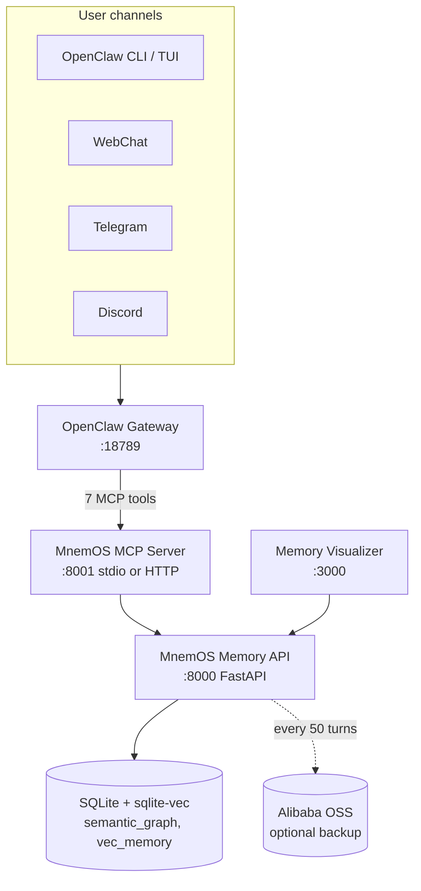
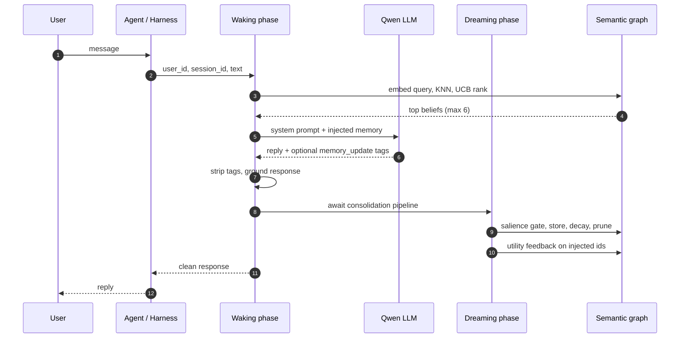
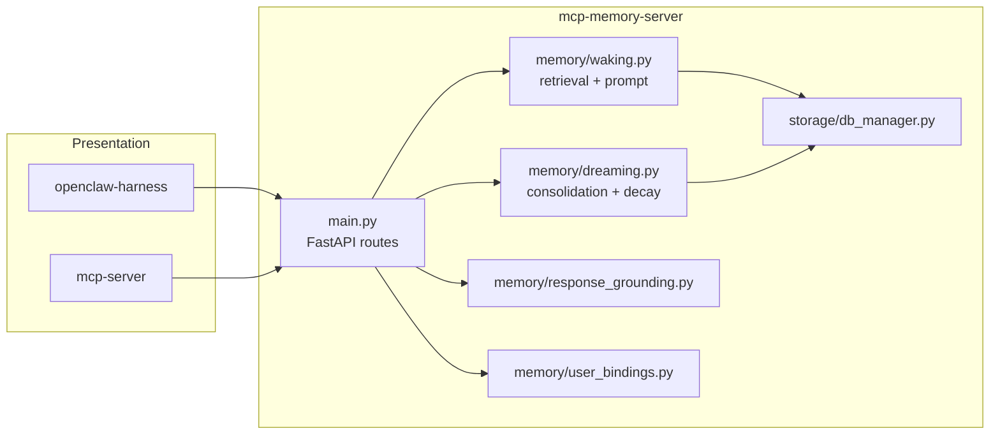

# MnemOS

Persistent memory layer for AI agents. MnemOS gates what enters long-term storage, retrieves beliefs with exploration-aware scoring, learns utility from usage, and prunes stale facts on a schedule.

**Submission:** Qwen Global AI Hackathon — Track 1: MemoryAgent  
**Repository:** https://github.com/crankysmh47/MnemAgent  
**License:** MIT

---

## Problem

RAG-style agent memory typically stores every utterance and retrieves by embedding similarity alone. That produces two recurring failures:

1. **Proactive interference** — outdated facts remain injectable alongside current ones.
2. **Unbounded noise** — low-value remarks accumulate until pruning is applied too late.

MnemOS addresses both at ingestion and retrieval, not as post-hoc filters.

---

## Solution

MnemOS implements a **two-phase cognitive loop** on every turn:

| Phase | Timing | Responsibility |
|-------|--------|----------------|
| **Waking** | Synchronous (user-facing) | Embed query, UCB-ranked retrieval, prompt assembly, LLM call, response grounding |
| **Dreaming** | Awaited before `/chat` reply by default (`AWAIT_DREAMING=true`) | Dual-path write, utility feedback, decay/prune, episodic log |

**Dual-path write** (prompt version `v4-dual-path-write`):

1. Parse `<memory_update>` facts from the LLM response when present.
2. Run server-side extraction on the user message when the model skips or non-complies.
3. Apply UCB utility feedback on injected beliefs.
4. Append an episodic turn and optionally sync to cloud storage.

**Ingestion rule:** store when `conviction >= 0.4` or `category == system_state`.

**Retrieval score:** `Score_i = Q_i + c * sqrt(ln(T) / (N_i + 1))` with `c = 0.3`.

---

## Hackathon alignment (Track 1: MemoryAgent)

| Requirement | MnemOS mechanism | Evidence |
|-------------|------------------|----------|
| Efficient storage | Salience auction rejects low-conviction noise before graph write | `salience_noise` scenario; dry-run 100% vs 75% baseline |
| Efficient retrieval | sqlite-vec KNN + UCB exploration; cap at 6 injected facts | O(1) prompt overhead regardless of graph size |
| Timely forgetting | Synaptic decay (inactive > 45 min) and hard prune (`node_weight < 0.1`) | Forgetting category +6.7 pp live vs baseline |
| Critical recall in limited context | Compound-probe full-belief injection; cross-session `user_id` graph | Project continuity **79–92%** vs **8%** baseline |
| Agent integration | Seven MCP tools; OpenClaw gateway; multi-channel ready | `openclaw mcp probe mnemos` → 7 tools |

Detailed methodology and scores: [docs/REPORT.md](docs/REPORT.md), [docs/LIVE_EVAL_RESULTS.md](docs/LIVE_EVAL_RESULTS.md).

---

## System context



---

## Turn sequence



---

## Component view



---

## Data model

```mermaid
erDiagram
  semantic_graph {
    int id PK
    string user_id
    string category
    string entity_source
    string relation
    string entity_target
    float base_utility_q
    int injection_count
    int influence_count
    float node_weight
    float conviction_score
  }

  vec_memory {
    int id PK_FK
    blob embedding
  }

  episodic_logs {
    int id PK
    string user_id
    string session_id
    text user_prompt
    text agent_response
  }

  memory_events {
    int id PK
    string user_id
    string event_type
    string entity_source
    string entity_target
    text detail
  }

  user_bindings {
    string user_id PK
    string channel
    string sender_id
    string display_name
  }

  semantic_graph ||--o| vec_memory : "belief embedding"
```

Beliefs are keyed per `user_id`. Channel senders map to a canonical id via `POST /api/user/bind` (`oc_{channel}_{hash16}`).

---

## Quick start

**Prerequisites:** Docker Desktop, Node.js 18+, Python 3.11+. Windows users may use WSL or PowerShell scripts.

```bash
git clone https://github.com/crankysmh47/MnemAgent.git
cd MnemAgent
cp config/env.template .env    # set QWEN_API_KEY
docker compose up -d --build
```

**Windows (full stack + OpenClaw):**

```powershell
.\scripts\launch.ps1
.\scripts\onboard-openclaw.ps1
```

| Resource | URL / command |
|----------|----------------|
| Memory visualizer | http://localhost:3000?user=demo-brain |
| MnemOS API health | http://localhost:8000/health |
| MCP server health | http://localhost:8001/health |
| OpenClaw dashboard | `openclaw dashboard` |
| Verify MCP tools | `openclaw mcp probe mnemos` |
| Terminal proof | `powershell -File scripts/prove-memory.ps1` |

Copy `config/env.template` to `.env`. OpenRouter free models work for development; DashScope Qwen is recommended for demos and evaluation.

---

## Services

| Container | Port | Role |
|-----------|------|------|
| `mnemos-memory` | 8000 | Beliefs, `/chat`, retrieval, dreaming, REST API |
| `mnemos-mcp` | 8001 | MCP tool surface for agents |
| `openclaw-harness` | 3000 | Live belief graph, event stream, API proxy |

```bash
docker compose up -d --build
```

---

## MCP tools

| Tool | Purpose |
|------|---------|
| `memory_resolve_user` | Bind channel sender to canonical `user_id` |
| `memory_bind_user` | Explicit user binding (same upsert path) |
| `memory_store` | Salience-gated fact ingestion |
| `memory_search` | Keyword search over beliefs |
| `memory_dump` | Full brain state (`/memory`) |
| `memory_stats` | UCB optimization table |
| `memory_chat` | Memory-augmented chat via MnemOS `/chat` |

Agent operating rules: [config/workspace/AGENTS.md](config/workspace/AGENTS.md).

Multiple agents share one brain when they use the same `MNEMOS_URL` and resolved `user_id`.

---

## Evaluation summary

| Suite | MnemOS | Baseline | Notes |
|-------|--------|----------|-------|
| Agentic (live, 4 scenarios) | **86.5%** | 64.6% | Headline: project continuity **79–92%** vs **8%** |
| Single-turn (live, 25 scenarios) | 43.7% | 45.0% | Wins contradiction (+15 pp) and forgetting (+6.7 pp) |
| Dry-run (architectural ceiling) | **100%** | 29% | Model-compliant structured output |

```bash
# Offline dry-run
python -m eval.run_benchmark --dry-run --mode both

# Live (MnemOS :8000 + API key)
python -m eval.run_benchmark --mode both
```

Full tables and integration proof: [docs/REPORT.md](docs/REPORT.md), [docs/LIVE_EVAL_RESULTS.md](docs/LIVE_EVAL_RESULTS.md).

---

## Repository layout

```
MnemAgent/
├── mcp-memory-server/   Python FastAPI memory engine (:8000)
├── mcp-server/          Node MCP adapter — 7 tools (:8001)
├── openclaw-harness/    Visualizer and API proxy (:3000)
├── config/              Environment template, OpenClaw workspace, patches
├── docker/              MnemOS memory service Dockerfile
├── requirements/        Python dependency pins (prod + dev)
├── scripts/             Setup, launch, onboarding, verification
├── eval/                Benchmark harness (MnemOS vs baseline)
├── tests/               pytest suite
└── docs/                Architecture, setup, evaluation reports
```

---

## Configuration

| Mode | LLM | Memory DB | Embeddings |
|------|-----|-----------|------------|
| Local dev | OpenRouter free (default in `env.template`) | SQLite Docker volume | `all-MiniLM-L6-v2` |
| Demo / eval | DashScope Qwen | Same | Same |
| Cloud backup | — | OSS snapshot every 50 turns | — |

Key environment variables: `QWEN_API_KEY`, `QWEN_MODEL`, `AWAIT_DREAMING`, `ENABLE_DREAMING_EXTRACTION`, `DB_PATH`.

---

## Verification

```bash
pytest tests/ -v
powershell -File scripts/integration-test.ps1
powershell -File scripts/submission-test.ps1
node openclaw-harness/scripts/check-visualizer.mjs
```

---

## Documentation

| Document | Contents |
|----------|----------|
| [docs/README.md](docs/README.md) | Documentation index |
| [docs/SETUP.md](docs/SETUP.md) | Prerequisites, models, channels, troubleshooting |
| [docs/ARCHITECTURE.md](docs/ARCHITECTURE.md) | Waking/dreaming detail, schema, design decisions |
| [docs/REPORT.md](docs/REPORT.md) | Benchmark results and design rationale |
| [docs/LIVE_EVAL_RESULTS.md](docs/LIVE_EVAL_RESULTS.md) | Live OpenClaw integration proof |

---

## Known limitations

- Influence detection uses proximity regex, not embedding similarity.
- `/chat` and REST APIs have no authentication; intended for demo and hackathon use.
- OSS backup is periodic snapshot sync, not live multi-region replication.
- Live single-turn recall depends partly on LLM compliance with structured output; server-side extraction mitigates but does not eliminate the gap.
- OpenClaw CLI runs on the host for multi-channel messaging; Docker provides MnemOS services only.

---

## License

MIT — see [LICENSE](LICENSE).
