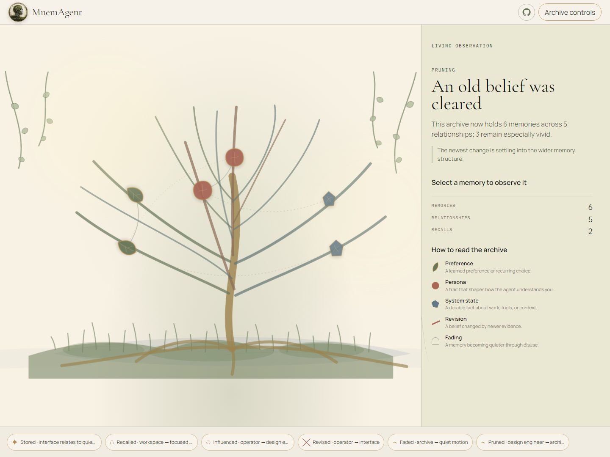
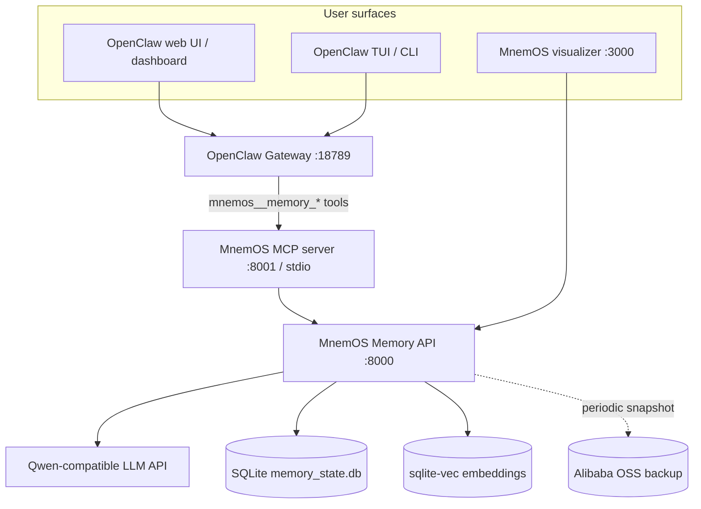
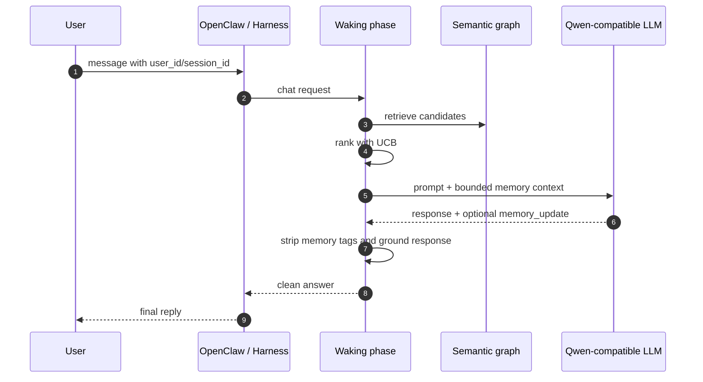
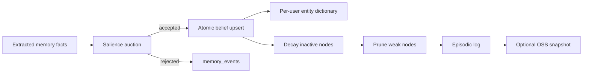
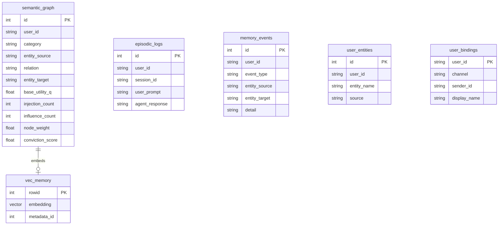

# MnemOS

Persistent memory for OpenClaw agents.

MnemOS gives an agent a long-term memory layer that is selective, inspectable, and user-scoped. It does not simply dump chat logs into a vector store. It decides what deserves storage, retrieves a bounded set of useful beliefs, resolves contradictions, and lets stale memories fade.

Submission: Qwen Global AI Hackathon, Track 1: MemoryAgent

Repository: https://github.com/crankysmh47/MnemAgent

License: MIT

## Table of contents

- [Quick start](#quick-start)
- [Visualizer snapshot](#visualizer-snapshot)
- [What MnemOS does](#what-mnemos-does)
- [Architecture](#architecture)
- [Memory engine](#memory-engine)
- [OpenClaw integration](#openclaw-integration)
- [Evaluation](#evaluation)
- [MnemBench status](#mnembench-status)
- [Demo video plan](#demo-video-plan)
- [Repository layout](#repository-layout)
- [Configuration](#configuration)
- [Verification](#verification)
- [Deployment notes](#deployment-notes)
- [License](#license)

## Quick start

Prerequisites:

- Docker Desktop
- Python 3.11+
- Node.js 18+
- OpenClaw CLI, for the real agent path
- A Qwen-compatible API key in `.env`

Clone and start the stack:

```bash
git clone https://github.com/crankysmh47/MnemAgent.git
cd MnemAgent
cp config/env.template .env
docker compose up -d --build
```

On Windows, the one-command local path is:

```powershell
cd C:\sem4\MnemAgent
.\scripts\launch.ps1
.\scripts\onboard-openclaw.ps1
```

Useful URLs and commands:

| Surface | URL or command |
|---------|----------------|
| Memory visualizer | http://localhost:3000?user=demo-brain |
| MnemOS API health | http://localhost:8000/health |
| MCP server health | http://localhost:8001/health |
| OpenClaw gateway | http://localhost:18789 |
| OpenClaw dashboard | `openclaw dashboard` |
| MCP proof | `openclaw mcp probe mnemos` |
| Local memory proof | `powershell -File scripts/prove-memory.ps1` |

## Visualizer snapshot



The visualizer is intentionally not another chat UI. It shows the memory graph: beliefs, categories, confidence, recall count, and semantic links.

## What MnemOS does

MnemOS solves two common agent memory failures.

First, ordinary RAG memory tends to over-store. Low-confidence thoughts, abandoned ideas, and casual suggestions enter the same store as real user preferences. MnemOS gates facts before they touch long-term memory.

Second, flat memory tends to recall stale facts. If a user switches from Express to FastAPI, both can remain retrievable unless the system has explicit contradiction handling. MnemOS keys beliefs by user, entity, and relation, so current facts replace superseded ones.

The system is built around four behaviors:

| Behavior | Mechanism |
|----------|-----------|
| Selective storage | Salience auction: store only conviction >= 0.4, except `system_state` facts |
| Bounded recall | sqlite-vec candidate search, UCB ranking, max 6 injected facts |
| Contradiction handling | Unique belief key: `(user_id, entity_source, relation)` |
| Forgetting | Inactive nodes decay and are pruned below `node_weight < 0.1` |

## Architecture



The product path is OpenClaw -> MCP -> MnemOS. The web visualizer is a companion surface for judges and developers to see memory forming in real time.

## Memory engine

Every chat turn goes through two phases.

### Waking phase

The waking phase is the user-facing path. It runs before the LLM answer is returned.



Retrieval uses:

- embeddings when sqlite-vec is available;
- keyword fallback using a global and per-user entity dictionary;
- UCB ranking: `Score_i = Q_i + c * sqrt(ln(T) / (N_i + 1))`;
- associative hops for larger graphs;
- a hard cap of 6 injected memories.

### Dreaming phase

The dreaming phase consolidates memory after the answer path has the information it needs.



The salience rule is deliberately simple:

```text
store if conviction >= 0.4 OR category == system_state
otherwise reject and log the event
```

That means "Maybe we should try Svelte someday" does not pollute long-term memory, while "The production region is ap-southeast-1" can be stored even if the model assigns lower confidence.

## Data model



The important constraint is on `semantic_graph`: one active value per `(user_id, entity_source, relation)`. That is the contradiction-resolution path.

## OpenClaw integration

MnemOS exposes seven MCP tools to OpenClaw:

| Tool | Purpose |
|------|---------|
| `memory_resolve_user` | Map a channel sender to a canonical `user_id` |
| `memory_bind_user` | Explicitly bind a channel and sender |
| `memory_store` | Store a salience-gated belief |
| `memory_search` | Search beliefs for a user |
| `memory_dump` | Show the full active brain state |
| `memory_stats` | Show UCB utility and recall statistics |
| `memory_chat` | Route a chat turn through MnemOS |

Typical agent proof:

```powershell
docker compose up -d
openclaw gateway start
openclaw mcp probe mnemos
```

Expected result: `mnemos` exposes 7 tools.

## Evaluation

The evaluation story has two layers.

The product repo keeps the hackathon-facing proof: live agentic tests, OpenClaw MCP checks, visualizer checks, and deployment preflight.

MnemBench is the companion benchmark suite for long-running memory behavior. It currently lives in this repository under `eval/mnembench/` and is planned as a separate public repository after the MnemOS submission is stable.

Headline local result from the current docs:

| Suite | MnemOS | Baseline | Notes |
|-------|--------|----------|-------|
| Live agentic benchmark | 86.5% | 64.6% | Cross-session and project-continuity advantage |
| Dry-run architectural ceiling | 100% | 29% | Confirms deterministic memory logic when extraction is ideal |

Run checks:

```bash
python -m eval.run_benchmark --dry-run --mode both
python -m eval.mnembench --dry-run --scenario contradiction_chain --judge-report
```

Read more:

- [docs/REPORT.md](docs/REPORT.md)
- [docs/LIVE_EVAL_RESULTS.md](docs/LIVE_EVAL_RESULTS.md)
- [docs/VERIFICATION.md](docs/VERIFICATION.md)

## MnemBench status

MnemBench is being split out as a separate public repository.

For the hackathon submission, the benchmark runner remains in this repository so judges can reproduce the numbers without chasing another dependency. After the MnemOS submission is frozen, the same suite will move into its own `mnembench` repo as an installable benchmark for long-running memory agents.

Current location:

```text
eval/mnembench/
```

Spin-out plan:

```text
docs/MNEMBENCH_SPINOUT.md
```

Planned standalone repo name:

```text
mnembench
```

The split is intentional:

- this repository stays focused on the submitted MnemOS product;
- the standalone `mnembench` repository becomes an installable benchmark package for any memory agent;
- external benchmark comparisons belong in the MnemBench repo, not in the MnemOS submission README.

## Demo video plan

The video script is stored here:

```text
docs/SUBMISSION_VIDEO_PLAN.md
```

The current script is built around a 3-minute flow:

1. Show the problem: ordinary agents forget or over-store.
2. Show MnemOS visualizer with `demo-brain`.
3. Teach three facts through OpenClaw using MCP tools.
4. Start a new chat and recall those facts.
5. Show the new nodes in the visualizer.
6. Store a contradiction and show the new value replacing the stale one.
7. Try a low-conviction memory and show it being rejected.
8. Show benchmark evidence.
9. Show Alibaba Cloud proof.

See the step-by-step recording section below for the exact commands.

## Repository layout

```text
MnemAgent/
├── mcp-memory-server/     Python FastAPI memory engine (:8000)
├── mcp-server/            Node MCP adapter for OpenClaw
├── openclaw-harness/      Visualizer and API proxy (:3000)
├── config/                Environment template, OpenClaw config, workspace files
├── docker/                Dockerfile for the memory API
├── requirements/          Python dependency pins
├── scripts/               Launch, reset, onboarding, deployment, verification
├── eval/                  Product benchmarks and MnemBench prototype
├── tests/                 pytest suite
└── docs/                  Architecture, setup, deployment, evaluation, video plan
```

## Configuration

Copy the template before running:

```bash
cp config/env.template .env
```

Important variables:

| Variable | Purpose |
|----------|---------|
| `QWEN_API_KEY` | Qwen-compatible API key |
| `QWEN_BASE_URL` | DashScope or workspace-compatible endpoint |
| `QWEN_MODEL` | Default model for chat/extraction |
| `DB_PATH` | SQLite memory database path |
| `AWAIT_DREAMING` | Whether chat waits for memory consolidation |
| `ENABLE_DREAMING_EXTRACTION` | Enables server-side fallback extraction |
| `MNEMOS_URL` | API URL used by MCP/OpenClaw |

Do not commit `.env`. The repo uses `config/env.template` for public configuration.

## Verification

Run the full backend suite:

```bash
python -m pytest tests -q
```

Check the visualizer:

```bash
node openclaw-harness/scripts/check-visualizer.mjs
```

Run integration proofs:

```powershell
powershell -File scripts/integration-test.ps1
powershell -File scripts/prove-memory.ps1
powershell -File scripts/prove-openclaw.ps1
```

## Deployment notes

The final deployment target is Alibaba Cloud ECS running the MnemOS backend, MCP server, and visualizer containers. Qwen-compatible inference is configured through the `.env` Qwen/DashScope settings.

For deployment and judge reset instructions, use:

- [docs/CLOUD.md](docs/CLOUD.md)
- [docs/JUDGE_DEPLOYMENT.md](docs/JUDGE_DEPLOYMENT.md)
- [docs/SUBMISSION_VIDEO_PLAN.md](docs/SUBMISSION_VIDEO_PLAN.md)

Cloud proof is handled through the deployment guide, preflight script, and OSS backup code path. The public README intentionally keeps those details brief; the exact recording workflow lives in the submission video plan.

## License

MIT. See [LICENSE](LICENSE).
