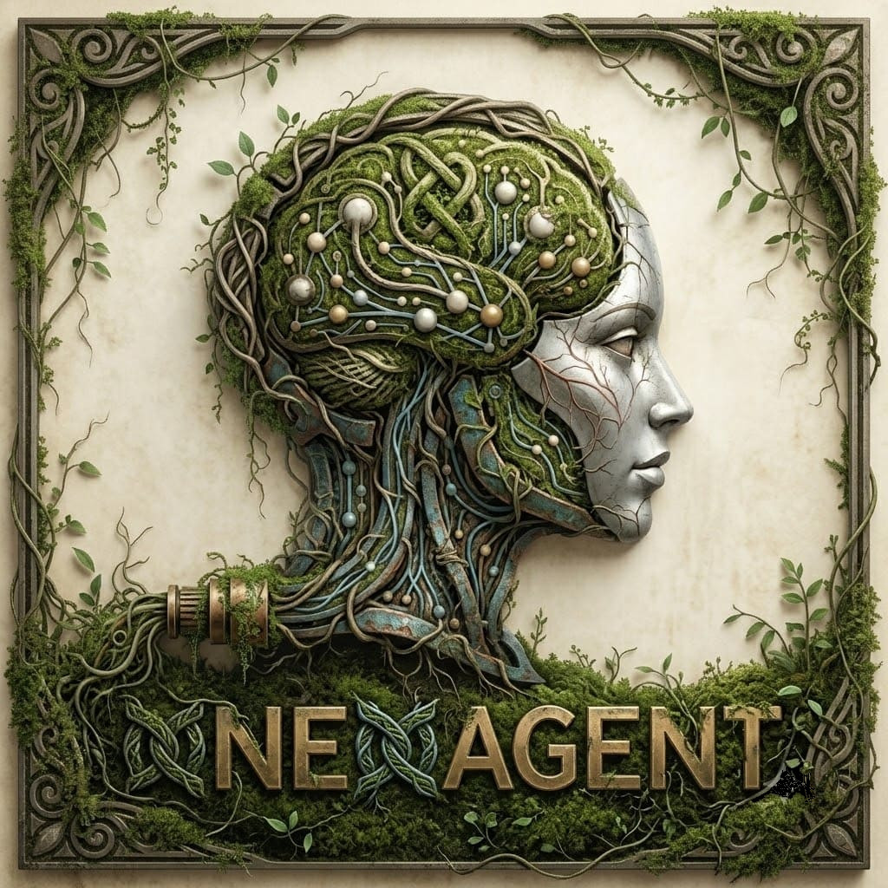
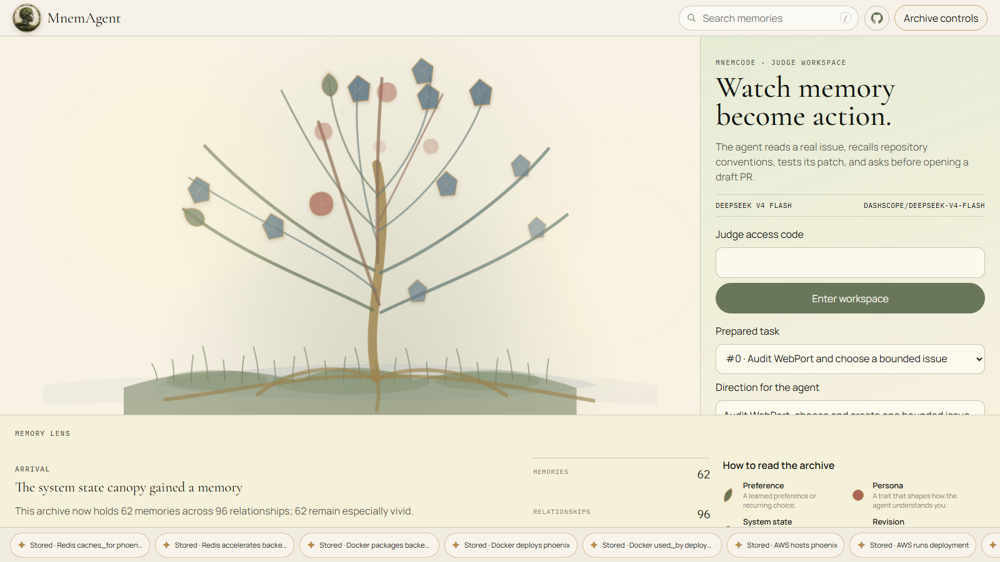
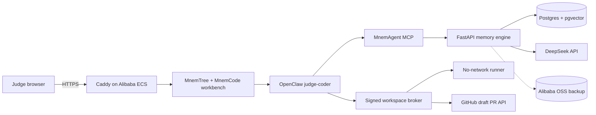

# MnemAgent

Persistent, scope-aware memory for coding agents. Submitted to the Qwen Global AI Hackathon, Track 1: MemoryAgent.

[](LICENSE)



MnemAgent learns preferences and project conventions across sessions, resolves contradictions inside the correct scope, forgets low-value facts, and makes every coding action visible in a living memory tree. MnemCode is the judge-facing coding workflow built on top: an OpenClaw agent works on one real issue in an isolated no-network container, runs fixed tests, and pauses before opening a draft PR.



## Start here

- Judges: [five-minute walkthrough](docs/JUDGE_GUIDE.md)
- System design: [architecture](docs/ARCHITECTURE.md)
- Measured results: [benchmarks](docs/BENCHMARKS.md)
- Alibaba ECS setup: [deployment guide](docs/DEPLOY_ALIBABA.md)
- Threat model: [security](docs/SECURITY.md)
- Coding-agent demo: [MnemCode demo](docs/MNEMCODE_DEMO.md)
- Submission readiness: [checklist](docs/SUBMISSION_CHECKLIST.md)

## Architecture



The public browser can read only `demo-brain`. Interactive runs require a signed judge session and CSRF token. OpenClaw cannot use a host shell, browser, or host filesystem. It receives only MnemAgent memory tools and the broker's structured repository tools. The broker owns the GitHub token; the runner never sees it and has no network.

## What the memory system does

MnemAgent splits each turn into two phases:

1. The waking phase retrieves at most six beliefs, ranks them with UCB, and adds a small memory context to the model call.
2. The dreaming phase extracts durable facts from the same response, applies a salience gate, resolves contradictions, updates utility, decays stale memories, and prunes dead nodes.

Coding memories have explicit scope:

- `core/core` holds durable user preferences.
- `repository/owner/repo` holds project conventions and review corrections.
- Repository retrieval returns at most four repository memories plus two core memories.
- A contradiction in one repository cannot overwrite a fact in another repository or core memory.

The graph API renders no more than 150 individual memories and 120 ambient relationships. Larger archives switch to hybrid or summary mode, while search can fetch a focused memory outside the first page.

## Judge flow

1. Open the deployed URL and inspect the populated public MnemTree.
2. Enter the private judge access code. This creates a random one-hour memory namespace with 30 chat turns, 5 coding runs, and 5 draft-PR approvals.
3. Tell the agent a durable coding preference. Send another message: it runs in a fresh OpenClaw session and can recall the first turn. The MnemTree switches to the private namespace and grows as memories are stored.
4. Start the prepared WebPort issue #14 task. Activity shows issue inspection, memory retrieval, file reads, test-first edits, and constrained test execution.
5. Inspect the memories, test results, and exact diff in their separate tabs.
6. Check the approval box and open a draft PR. The broker cannot push to `main` or publish before this explicit approval.

The validated acceptance run uses `crankysmh47/WebPort`: the agent handled [issue #14](https://github.com/crankysmh47/WebPort/issues/14), retrieved repository-scoped memory, wrote the regression test first, added the four-line guard with `deepseek-v4-flash`, passed the focused and complete unit suites, and produced [draft PR #15](https://github.com/crankysmh47/WebPort/pull/15). The PR touches only the source file and its regression test, and its sole commit is authored by `crankysmh47 <annankhan741@gmail.com>`.

## Local setup

Requirements: Docker Desktop or Docker Engine with Compose v2, Git, and 8 GB of free memory.

```bash
git clone https://github.com/crankysmh47/MnemAgent.git
cd MnemAgent
git switch MnemCode
cp config/env.template .env
```

Set the model keys in `.env`, then build and start:

```bash
docker compose --profile judge-build build workspace-runner
export JUDGE_GITHUB_TOKEN="$(gh auth token)"
docker compose up -d --build
```

On Windows, `./scripts/start-demo.ps1` reads the GitHub token from the authenticated `gh` keyring for the lifetime of the process, starts the stack, and seeds `demo-brain`. It never writes the token to the repository or `.env`.

Open `http://localhost:3000/?user=demo-brain`. Local judge access defaults to `mnemcode-local-judge`; cloud mode refuses to start with missing judge secrets.

Run the checks:

```bash
python -m pytest -q
npm test --prefix openclaw-harness
npm test --prefix workspace-runner
npm test --prefix workspace-broker
node openclaw-harness/scripts/check-visualizer.mjs
```

## Cloud deployment

MnemAgent is designed for one low-cost Alibaba ECS instance in Hong Kong. Caddy is the only public service. Postgres, the memory API, MCP, and workspace broker stay on the Compose network or loopback.

```bash
cp .env.cloud.example .env.cloud
# Replace every placeholder and use a fine-grained GitHub token for one demo repository.
./scripts/deploy-cloud.sh
./scripts/verify-cloud.sh
```

The required Alibaba proof is in [cloud sync](mcp-memory-server/src/storage/cloud_sync.py) and the [Alibaba deployment script](scripts/deploy-alibaba.sh). See the deployment guide for the exact ECS, security-group, DNS, TLS, OSS, and spot-instance steps.

## Engineering details

- FastAPI, PostgreSQL 16, pgvector, and a disposable SQLite test adapter
- One model call per normal chat turn; memory extraction shares the response
- UCB exploration plus vector/keyword retrieval and associative graph hops
- Salience-gated writes, atomic scoped contradictions, prospective cue memories, decay, and pruning
- OpenClaw with a per-agent deny policy and filtered MCP tools
- HMAC-signed broker requests with replay protection
- Diff-bound approval tokens that expire after five minutes
- Runner limits: no network, read-only root, non-root user, dropped capabilities, 768 MB RAM, 0.75 CPU, 128 PIDs
- Sponsored guardrails: at most 12 one-hour judge sessions per process and a 2,000,000-token coding budget, followed by replay mode

## API summary

| Route | Purpose |
|---|---|
| `POST /chat` | Memory-augmented agent turn |
| `POST /api/memory/store` | Salience-gated fact storage |
| `GET /api/memory/search/:uid` | Bounded memory search |
| `GET /api/graph/:uid` | Scalable MnemTree payload |
| `GET /api/events/:uid` | Memory lifecycle events |
| `POST /judge/session` | Signed judge access session |
| `GET /api/judge/session` | Current private namespace and remaining allowance |
| `POST /api/judge/chat` | Start one fresh-session memory chat turn |
| `GET /api/judge/chat/:id` | Poll a chat turn without blocking the web request |
| `POST /api/judge/runs` | Start an observable OpenClaw run |
| `GET /api/judge/runs/:id` | Read run state and ordered evidence |
| `POST /api/judge/runs/:id/approve` | Open the reviewed change as a draft PR |

## Benchmarks

The repository contains the stable run reports, reproduction method, and stated limitations. Start with [docs/BENCHMARKS.md](docs/BENCHMARKS.md); the full historical report is retained under `docs/archive`. MnemBench v1 and v2 results are labeled separately and are never mixed.

## License

MIT. See [LICENSE](LICENSE).
