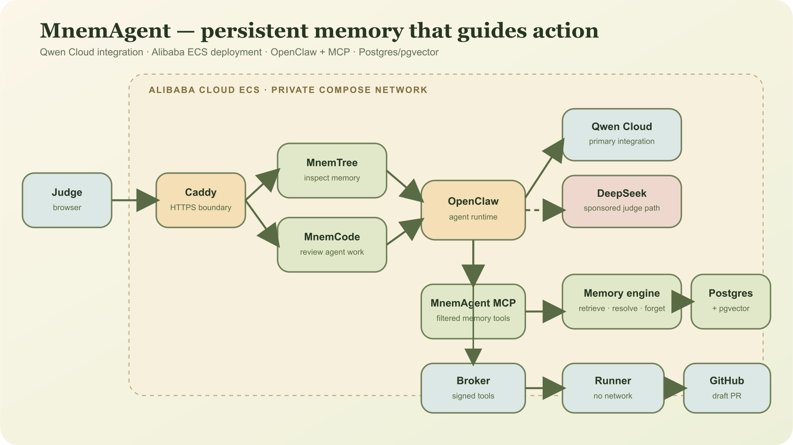
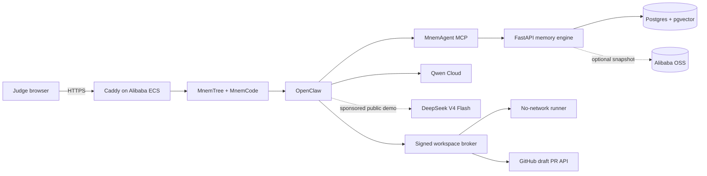
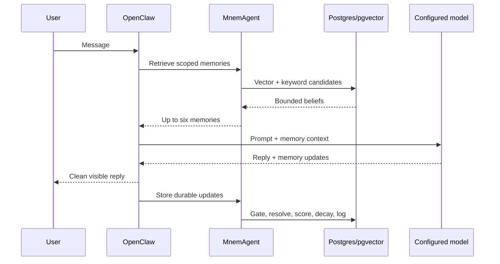
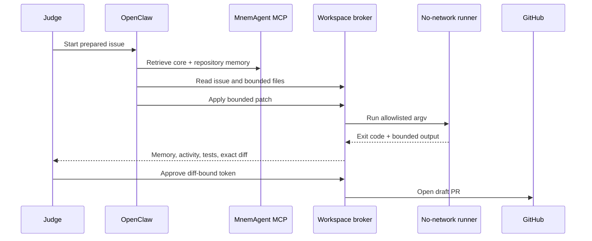

# Architecture

MnemAgent is a persistent memory control plane for OpenClaw. It is intentionally separate from the agent's model and tools: OpenClaw remains the agent runtime, while MnemAgent decides which beliefs deserve storage, which should be recalled now, which newer facts replace older ones, and which memories should fade.



## System boundary



Qwen Cloud is the primary hackathon integration path. The public deployment uses a small sponsored DeepSeek allowance so judges can interact without bringing a key. Both paths call the same provider-neutral memory engine; their results are never mixed in the evidence.

## One turn, two phases



### Waking phase

The synchronous path must stay small:

1. Embed the current query or use deterministic keyword fallback.
2. Fetch a bounded candidate set from pgvector and keyword search.
3. Rank candidates with learned utility plus Upper Confidence Bound exploration.
4. Follow a small number of associative edges.
5. Inject no more than six active beliefs.

The exploration score is:

```text
score_i = Q_i + c * sqrt(ln(T) / (N_i + 1))
```

- `Q_i`: learned usefulness of belief `i`
- `T`: episodic turns for this user
- `N_i`: how often the belief has been injected
- `c`: exploration constant, currently `0.3`

This gives useful memories priority without permanently starving a dormant but potentially important belief.

### Dreaming phase

The visible response and structured memory updates come from the same model response, avoiding a second model call on the normal chat path. The background phase:

1. Parses one or more structured memory updates.
2. Rejects low-conviction noise before storage.
3. Replaces a conflicting belief only inside the same scope.
4. Updates retrieval utility using whether injected beliefs influenced the answer.
5. Decays inactive memories and prunes nodes below the threshold.
6. Appends lifecycle events for MnemTree.

The default storage rule is:

```text
store when conviction >= 0.4 or category == system_state
```

## Memory model

| Tier | Store | Role |
| --- | --- | --- |
| Working | Last three turns in process | Immediate conversational continuity |
| Episodic | `episodic_logs` | Session history and UCB turn count |
| Semantic | `semantic_graph` | Durable beliefs eligible for recall |
| Vector | pgvector column/index | Semantic candidate search |
| Event | `memory_events` | Stored, recalled, revised, faded, and pruned events |

The active belief identity is:

```text
(user_id, scope_type, scope_id, entity_source, relation)
```

That uniqueness contract makes contradiction handling atomic. A repository correction cannot overwrite a core preference or a fact from another repository.

## Scope-aware coding memory

MnemCode uses two scopes:

- `core/core`: stable user preferences that should follow the person.
- `repository/owner/repo`: conventions and corrections that apply only to one codebase.

Repository retrieval reserves up to four slots for the active repository and two for core memory. Prompt overhead therefore remains constant even when the archive contains thousands of beliefs.

## Forgetting

MnemAgent does not treat deletion as failure. Inactive nodes decay by `0.85` after the configured inactivity window. Beliefs below `0.1` are pruned. A contradiction immediately supersedes the matching scoped belief and records both the old and new value in the event log.

This addresses three different problems:

- **Noise:** rejected before insertion by the salience gate.
- **Staleness:** replaced atomically by scoped contradiction resolution.
- **Disuse:** gradually reduced through decay and eventual pruning.

## Scalable MnemTree API

The graph endpoint performs bounded reads independent of archive size:

- at most 150 individual beliefs;
- at most 120 ambient relationships;
- total counts and category summaries returned separately;
- individual mode through 120 memories;
- hybrid mode from 121 through 500;
- summary-first mode above 500;
- debounced search can retrieve a focused memory outside the initial page.

The browser lays out only returned nodes. It does not run collision or edge algorithms over the complete archive.

## MnemCode control plane



OpenClaw cannot call a host shell, browser, generic web tool, or host filesystem. It receives filtered memory and repository MCP tools. The broker alone sees the fine-grained GitHub token. The runner has no network and receives neither provider nor GitHub credentials.

## Seven-day judge identity

The browser receives a signed HttpOnly, SameSite=Strict cookie and a separate CSRF value. Both the cookie and server-side allowance expire after seven days. The allowance is atomically persisted in a Docker volume, so restarts do not invalidate active judges or replenish spent quota.

Persisted state contains only random session IDs, random namespaces, expiry, remaining quota, and in-flight counters. Interrupted reservations are refunded on recovery because their corresponding run state did not complete. Cookie signing and same-origin checks remain the identity boundary.

## Cloud deployment boundary

Only Caddy publishes a port. The following stay on the Compose network or loopback:

- OpenClaw harness
- MnemAgent MCP server
- FastAPI memory engine
- Postgres/pgvector
- workspace broker
- runner control plane

Alibaba OSS snapshots are optional. Postgres remains the system of record in the current deployment, with a direct path to managed Alibaba RDS later.

## Failure behavior

- Model failure returns a bounded error and does not invent a successful memory write.
- A failed chat/coding launch releases its reserved allowance.
- A failed test run never produces an approval token.
- Approval expires after five minutes and is bound to the exact diff and PR metadata.
- Spot interruption blocks new runs before shutdown; no draft PR opens without complete evidence.
- Public anonymous requests can read only `demo-brain`.

## Why the pieces are separate

MnemTree, MnemBench, and MnemCode are proof surfaces around the same memory MCP:

- MnemTree answers, “What does the agent believe?”
- MnemBench answers, “Does that memory improve behavior?”
- MnemCode answers, “Does remembered experience change a real agentic action safely?”

None is required to use the core. An ordinary OpenClaw deployment can connect directly to the MCP servers and retain the rest of its integrations.
