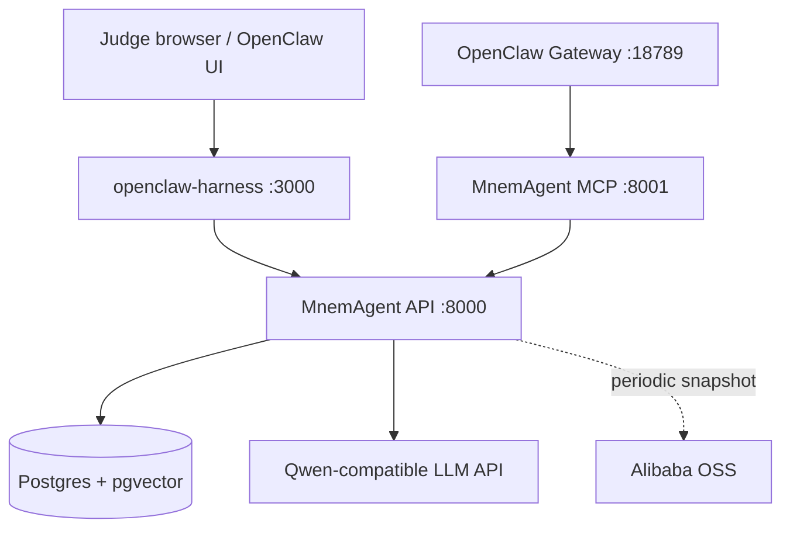

# MnemAgent Cloud Deployment

MnemAgent's product deployment target is Alibaba Cloud ECS running Docker
Compose with Postgres/pgvector as the live memory store. Alibaba OSS snapshot
sync is optional but recommended for proof and recovery.

## Runtime Shape



## Recommended ECS Instance

| Setting | Value |
| --- | --- |
| OS | Ubuntu 22.04 or Debian 12 |
| CPU | 2 vCPU minimum, 4 vCPU preferred |
| Memory | 4 GiB minimum |
| Disk | 40 GiB system disk |
| Security group | Open 22, 3000, 18789 only as needed |

Keep ports `8000`, `8001`, and `5432` private whenever possible. Expose the
visualizer and OpenClaw UI through a reverse proxy or temporary security-group
rule for judging.

## Deploy

```bash
git clone https://github.com/crankysmh47/MnemAgent.git
cd MnemAgent
cp config/env.template .env
```

Edit `.env`:

```env
LLM_PROVIDER=openai_compatible
LLM_API_KEY=...
LLM_BASE_URL=https://dashscope.aliyuncs.com/compatible-mode/v1
LLM_MODEL=qwen-flash

STORAGE_BACKEND=postgres
POSTGRES_DB=mnemagent
POSTGRES_USER=mnemagent
POSTGRES_PASSWORD=<strong-password>
DATABASE_URL=postgresql://mnemagent:<strong-password>@postgres:5432/mnemagent
```

Start the stack:

```bash
docker compose up -d --build
docker compose ps
```

Verify:

```bash
curl http://127.0.0.1:8000/health
curl http://127.0.0.1:8001/health
curl http://127.0.0.1:3000/health
```

Run the judge preflight:

```powershell
pwsh ./scripts/deploy-preflight.ps1
```

## Judge Reset

Before giving judges the URL, clear test users while preserving `demo-brain`:

```powershell
pwsh ./scripts/reset-cloud-memory.ps1
```

The reset script deletes non-demo rows from Postgres tables, refreshes the judge
user id, and restarts services unless `-NoDockerRestart` is passed.

## Alibaba Cloud Proof

Record a short clip showing:

1. Alibaba Cloud ECS console with the running instance and public IP.
2. SSH terminal on the instance running `docker compose ps`.
3. `curl http://127.0.0.1:8000/health` returning `status: ok`.
4. Browser opening `http://<ecs-ip>:3000?user=demo-brain`.
5. The code path for OSS backup: `mcp-memory-server/src/storage/cloud_sync.py`.

For OSS proof, configure:

```env
ALIBABA_CLOUD_ACCESS_KEY_ID=...
ALIBABA_CLOUD_ACCESS_KEY_SECRET=...
ALIBABA_CLOUD_OSS_BUCKET=...
ALIBABA_CLOUD_OSS_ENDPOINT=https://oss-ap-southeast-1.aliyuncs.com
```

Postgres snapshots are created with `pg_dump` and uploaded under:

```text
agent_runtime/backups/mnemagent_pg_<timestamp>.dump
```
