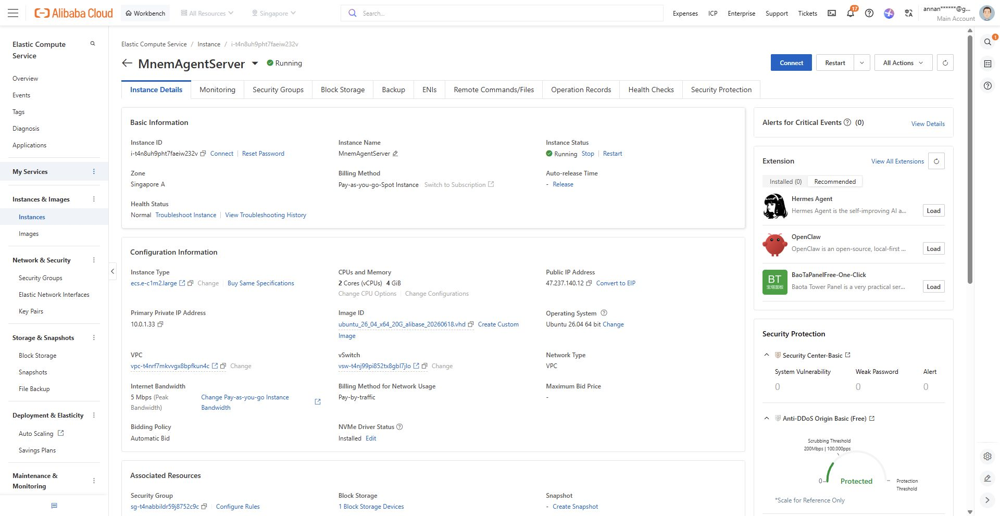
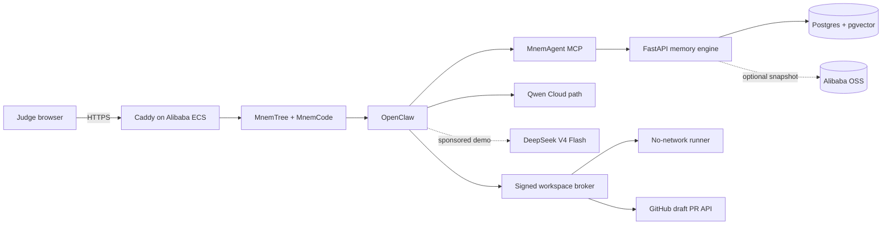

# Alibaba Cloud deployment proof

This page collects the two pieces of deployment evidence required by the Qwen Global AI Hackathon: visible Alibaba Cloud resources and a repository code file containing an accepted Qwen Cloud endpoint.

## 1. Running Alibaba Cloud resource

**Public deployment:** [https://47-237-140-12.sslip.io/](https://47-237-140-12.sslip.io/)<br>
**Console evidence captured:** July 19, 2026<br>
**Release verified:** July 20, 2026<br>
**Verified application commit:** [`e73a828`](https://github.com/crankysmh47/MnemAgent/commit/e73a828)

**Alibaba region:** Singapore (`ap-southeast-1`)  
**ECS instance:** `i-t4n8uh9pht7faeiw232v` / `MnemAgentServer`  
**Shape:** `ecs.e-c1m2.large`, 2 vCPU, 4 GiB  
**Billing:** pay-as-you-go spot instance (`SpotAsPriceGo`)  
**Public IP:** `47.237.140.12`



The screenshot is from the authenticated Alibaba Cloud Workbench/ECS console. It shows the instance name and ID, running state, Singapore A zone, spot billing, public IP, and compute shape.

Public health response captured from the deployed HTTPS endpoint:

```json
{"status":"ok","services":{"memory":true,"mcp":true,"demo":true}}
```

The public boundary exposes only Caddy on ports 80/443. The memory API, MCP server, Postgres database, OpenClaw harness, workspace broker, and runner control plane are private or loopback-only.

### Live judge-flow verification

On July 20, 2026, commit `e73a828` was deployed from the public `MnemCode` branch. The repository verifier passed HTTPS, OpenClaw, signed seven-day judge sessions, the sponsored 30-chat/5-run/5-PR allowance, populated demo UI, public archive policy, MCP health, and workspace-broker health. The public landing page opens on the 62-memory demo and presents [MnemBench issue #1](https://github.com/crankysmh47/MnemBench/issues/1) as the coding task.

The matching end-to-end acceptance run used two fresh OpenClaw conversations: one stored the repository rule that every metric must be oriented so `1.0` means best, and the next recalled that rule while solving the issue. The isolated runner added three tests and passed both configured test gates before the approval boundary opened [draft PR #2](https://github.com/crankysmh47/MnemBench/pull/2). The PR is preserved as public evidence so judges can inspect the result without consuming sponsored capacity or creating a duplicate PR.

## 2. Qwen Cloud code proof

The production settings file contains Alibaba Cloud Model Studio's accepted international OpenAI-compatible base URL:

- [mcp-memory-server/src/config.py](../mcp-memory-server/src/config.py)
- [config/qwen-cloud.example.env](../config/qwen-cloud.example.env)
- [Qwen/OpenClaw example configuration](../openclaw-harness/openclaw-config/mnemos.config.json)

```text
https://dashscope-intl.aliyuncs.com/compatible-mode/v1
```

`qwen_client.py` appends `/chat/completions`, sends the configured Qwen model and bearer token, and parses the same response into user-visible text plus structured memory updates. API keys are supplied only through environment variables.

Optional Alibaba OSS snapshot support is implemented in [cloud_sync.py](../mcp-memory-server/src/storage/cloud_sync.py). It uses `oss2`, performs `pg_dump` for the Postgres runtime, and uploads timestamped snapshots when OSS credentials are configured.

## Runtime model disclosure

Two model paths are intentionally distinguished:

- **Qwen Cloud integration and evaluation:** the accepted DashScope international endpoint, Qwen configuration, and live Qwen/OpenClaw memory evidence.
- **Sponsored public judge runtime:** DeepSeek V4 Flash, funded by the project owner so judges can test without supplying a key.

No DeepSeek-backed run is presented as a Qwen-backed result. The deployment demonstrates the provider-neutral memory architecture while the linked code and live evaluation demonstrate the Qwen Cloud integration required by the track.

## Deployment topology



## Reproduce the checks

On the ECS host:

```bash
./scripts/verify-cloud.sh
```

The script checks HTTPS, OpenClaw, the signed seven-day judge session and 30/5/5 allowance, the populated UI, public archive policy, MCP health, and workspace broker health. Deployment steps and the current judging-window cost posture are in [DEPLOY_ALIBABA.md](DEPLOY_ALIBABA.md).
