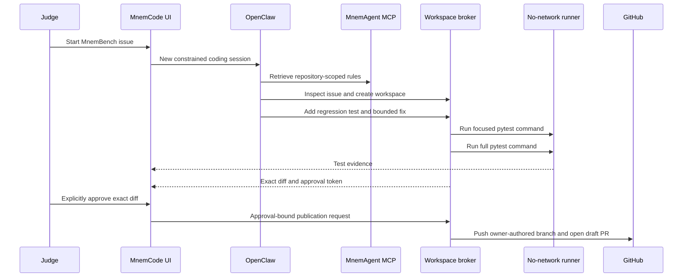

# MnemCode: public agentic coding proof

MnemCode demonstrates why persistent memory matters after retrieval: the remembered convention changes how an agent edits a real repository.

## Prepared public task

- Repository: [crankysmh47/MnemBench](https://github.com/crankysmh47/MnemBench)
- Issue: [#1 — Fix inverted contradiction dimension score](https://github.com/crankysmh47/MnemBench/issues/1)
- Defect: a correctly resolved contradiction receives `1.0`, then aggregation incorrectly subtracts it from `1.0` and reports failure.
- Required memory: every MnemBench metric must use `1.0` for best behavior and `0.0` for failure.
- Required change: add a regression test, then remove only the incorrect aggregation inversion.
- Verified result: [draft PR #2](https://github.com/crankysmh47/MnemBench/pull/2), created by the approval-gated judge workflow on July 20.

This is a real benchmark-integrity defect. It is small enough for a deterministic judge run and meaningful enough to show that repository memory affects an engineering decision.

The acceptance run added three tests for perfect, stale-only, and partial contradiction resolution. `python-scoring-test` and `python-unit` both passed before publication became available.

## Execution path



## Fixed runner commands

The model cannot choose arbitrary shell commands. The broker accepts only these identifiers:

```text
python-scoring-test -> python -m pytest -q tests/test_scoring.py
python-unit         -> python -m pytest -q
```

The runner image contains Python, pytest, and the benchmark's runtime dependency before a judge session begins. Runtime networking and package installation are unavailable.

## Edit and publication boundaries

- Repository allowlist: only `crankysmh47/MnemBench`
- Editable Python paths: `mnembench/*.py` and `tests/*.py`
- Patch limit: five files and 500 changed lines
- Runner: non-root, read-only container, no network, dropped Linux capabilities
- Token location: private broker only
- Publication: both fixed checks plus a five-minute approval token bound to the exact diff and PR metadata
- Git identity: repository owner only

Arbitrary repository execution would need broader token permissions, language-specific runner images, dependency-install policy, and stronger multi-tenant isolation. The submission exposes one honest, repeatable task rather than implying those controls already exist.
