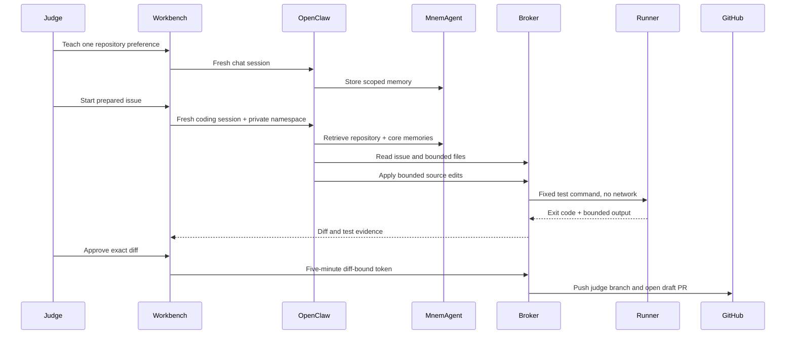

# MnemCode demo

MnemCode turns MnemAgent's memory engine into a concrete coding-agent test. The use case is deliberately narrow: one repository, one workspace, one runner, and draft PRs only.

## Run lifecycle

## WebPort acceptance case

The completed acceptance run is captured in [WebPort issue #14](https://github.com/crankysmh47/WebPort/issues/14) and [draft PR #15](https://github.com/crankysmh47/WebPort/pull/15):

1. The server gives each judge a random private memory namespace and a small sponsored allowance.
2. Chat uses a new OpenClaw session on every turn while retaining that namespace, so cross-session recall is visible before the coding task starts.
3. The coding agent reads issue #14, retrieves repository memory, and creates one isolated workspace tied to that issue.
4. It reads only bounded files, writes a regression test first, applies the implementation, and runs WebPort's fixed unit/validation commands.
5. The workbench separates ordered activity, retrieved memory, tests, and the exact diff.
6. A human reviews the evidence before the broker opens a draft PR.

The constrained runner passed the focused numeric-command regression test and WebPort's complete unit test command before the branch was published. The resulting diff adds four source lines and 24 regression-test lines. The commit is authored only as `crankysmh47 <annankhan741@gmail.com>`.

Model: `deepseek-api/deepseek-v4-flash` in OpenClaw, sent as `deepseek-v4-flash` to the official DeepSeek API. The judge stack does not use the Qwen/DashScope key and does not accept an OpenRouter key.

## Hard limits

- Five files and 500 changed lines per patch
- 120 KB patch body
- Fixed test command IDs only
- One active coding run
- No network in runner
- Five-minute approval
- 30 chat turns, 5 coding runs, and 5 draft publications per judge session
- One-hour sponsored session, shown as action quotas rather than a misleading dollar estimate
- Twelve sponsored sessions and a 2,000,000-token coding hard stop before replay mode
