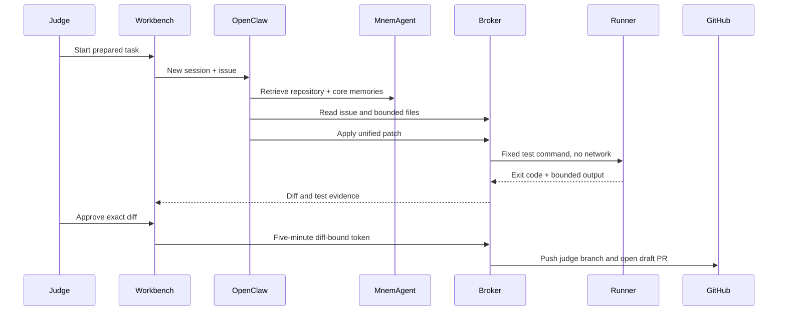

# MnemCode demo

MnemCode turns MnemAgent's memory engine into a concrete coding-agent test. The use case is deliberately narrow: one repository, one workspace, one runner, and draft PRs only.

## Run lifecycle

## WebPort acceptance case

WebPort currently has no open issue. That is useful for the final test:

1. The agent creates issue-0 audit workspace and lists repository files.
2. It reads tests, contribution rules, and a small set of relevant sources.
3. It selects a reproducible defect with a bounded test plan.
4. It creates the GitHub issue, removes the audit workspace, and creates a fresh workspace tied to the new issue number.
5. It retrieves repository memory, writes a test first, applies the implementation, and runs WebPort's fixed unit/validation commands.
6. A human reviews the diff before the broker opens a draft PR.

Model: `dashscope/deepseek-v4-flash` through the configured DashScope-compatible endpoint. The judge stack does not accept an OpenRouter key.

## Hard limits

- Five files and 500 changed lines per patch
- 120 KB patch body
- Fixed test command IDs only
- One active workspace
- No network in runner
- Five-minute approval
- $4.50 global model hard stop
