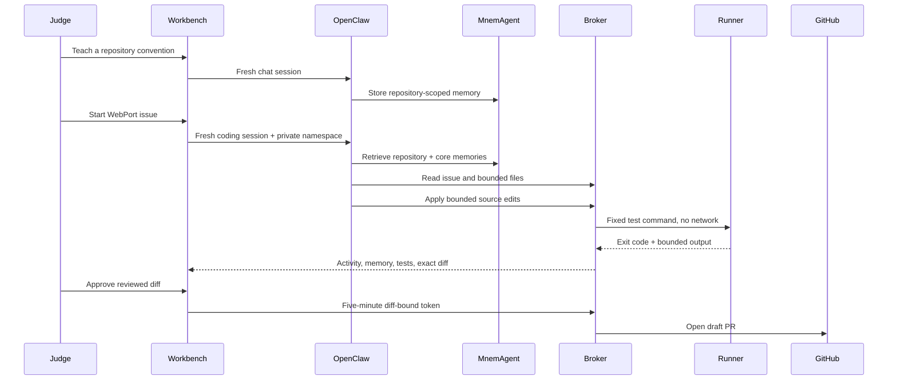

# MnemCode: memory with consequences

MnemCode is the judge-facing coding workflow built on MnemAgent and OpenClaw. Its purpose is not to imitate a general cloud IDE. It gives one concrete answer to a more important question: **does remembered experience change what an agent does on a real task?**

## Run lifecycle

## Validated WebPort run

The acceptance path is preserved in [issue #14](https://github.com/crankysmh47/WebPort/issues/14) and [draft PR #15](https://github.com/crankysmh47/WebPort/pull/15).

The agent:

1. entered a random private memory namespace;
2. stored and retrieved repository guidance through MnemAgent MCP;
3. inspected the prepared issue and bounded source files;
4. wrote the numeric-command regression test first;
5. added the small implementation guard;
6. passed the focused regression and complete unit command;
7. exposed the retrieved memory, test output, and exact diff separately;
8. waited for human approval before the broker opened a draft PR.

The published diff contains only the relevant source file and regression test. Its sole commit uses the repository owner's configured author identity.

## Current public model path

The sponsored judge workflow uses `deepseek-v4-flash` through the official DeepSeek API. It does not ask judges for a model key and does not expose an OpenRouter option. Qwen Cloud integration and Qwen benchmark evidence are documented separately.

## Hard limits

- Five files and 500 changed lines per patch
- 120 KB patch body
- Fixed test-command identifiers and exact argv arrays
- One active coding run per session
- No network in the runner
- Five-minute diff-bound publication approval
- 30 chat turns, five coding runs, and five draft publications
- Seven-day signed session; quotas persist across harness restarts
- Twelve concurrent sponsored sessions
- 2,000,000 measured coding-token ceiling before replay mode

## Why the workflow is narrow

Arbitrary repository execution would require broader token permissions, package-install policy, per-language sandbox images, and stronger multi-tenant isolation. Those are product tasks, not switches hidden from judges. The WebPort case is intentionally repeatable and reviewable.

Broader one-click repository/task packs are in progress. The core MnemAgent MCP servers already work without MnemCode, so users can attach memory to a normal OpenClaw deployment and retain its wider integrations today.
